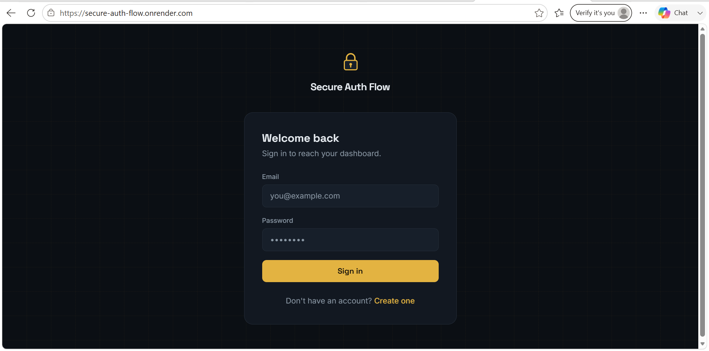
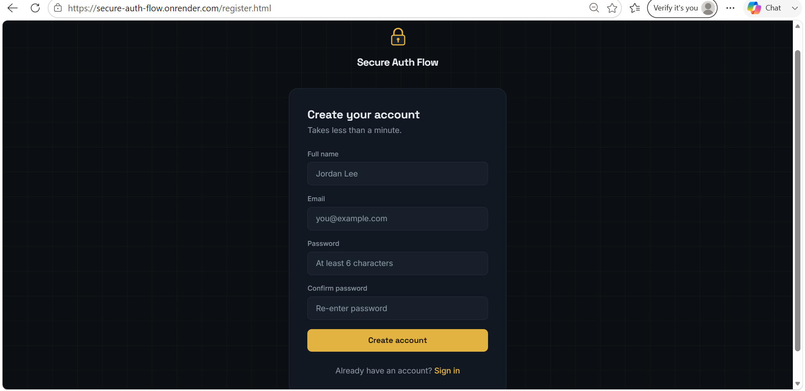
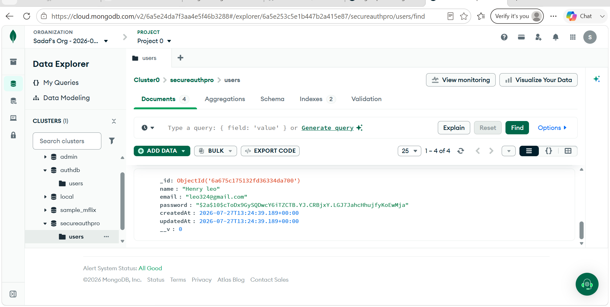

# Secure Auth Flow 

A plain-stack rebuild of the same auth flow: Register, Login, and a
JWT-protected Dashboard (view profile, update name, change password).

- **Backend:** Node.js + Express + Mongoose (MongoDB), plain JavaScript
- **Frontend:** Plain HTML + vanilla JavaScript + Tailwind CSS 
- **Auth:** JWT bearer tokens, passwords hashed with bcrypt

## Project layout

```
secure-auth-flow-js/
├── server/              Express API (serves the frontend too)
│   ├── config/db.js
│   ├── controllers/
│   ├── middleware/auth.js
│   ├── models/User.js
│   ├── routes/
│   ├── server.js
│   └── .env.example
└── public/              Plain HTML/CSS/JS frontend
    ├── index.html       Login
    ├── register.html    Register
    ├── dashboard.html   Dashboard (protected)
    ├── css/style.css
    └── js/
```
## Screenshot
## Login Page



## Registration Page

## DashBoard

.png)
## NoSQLDB




## Setup

1. `cd server`
2. `npm install`
3. Copy `.env.example` to `.env` and fill in:
   - `MONGODB_URI` — your MongoDB connection string (e.g. from MongoDB Atlas)
   - `JWT_SECRET` — any long random string
   - `PORT` — defaults to `5000`
4. `npm start` (or `npm run dev` to auto-restart on changes)
5. Open `http://localhost:5000` — the Express server serves both the API
   (`/api/...`) and the frontend from the same port, so there's no CORS
   setup to worry about.

## API endpoints

| Method | Path                 | Auth | Description              |
|--------|----------------------|------|---------------------------|
| POST   | /api/auth/register   | No   | Create an account         |
| POST   | /api/auth/login      | No   | Sign in, returns a JWT     |
| GET    | /api/auth/me         | Yes  | Get current user profile  |
| PUT    | /api/user/profile    | Yes  | Update name                |
| PUT    | /api/user/password   | Yes  | Change password            |


 🌐 Live Demo

🔗 https://secure-auth-flow.onrender.com/

 


